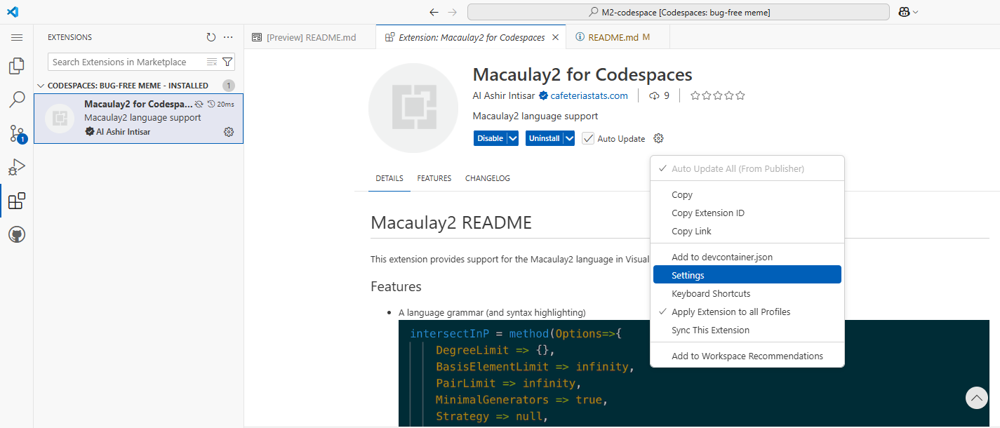
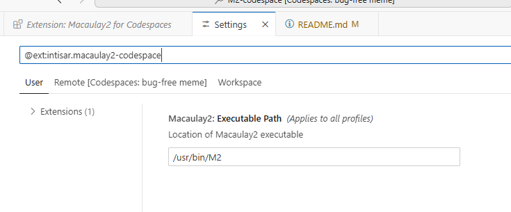

# Macaulay2 (M2)-codespace
Codespace setup for Macaulay2 (M2)

## Checking if Codespace Was Set Up Properly

1. **Reload the VS Code window** to apply all settings:
   - Press `Cmd+Shift+P` (Mac) or `Ctrl+Shift+P` (Windows/Linux)
   - Search for and select: `Reload Window`

   Or run this in the Command Palette:


2. **Fix Macaulay2 executable path errors**:
If you see an error like “Cannot find Macaulay2 executable”, it's likely caused by conflicting user settings.

- To confirm this executable path error
- Go to the extension settings as shown in the image below:



👉 To fix this, **turn off Settings Sync** in VS Code:

- Open the Command Palette (`Cmd/Ctrl + Shift + P`)
- Search for:  
  ```
  > Settings Sync: Turn Off
  ```

- Confirm when prompted.

3. **Check the Codespace creation log** to confirm Macaulay2 was installed correctly:
- Open the Command Palette (`Cmd/Ctrl + Shift + P`)
- Search for and select: `Codespaces: View Creation Log`
- Look for confirmation messages like:
  ```
  ✅ Macaulay2 installed successfully!
  ```


✅ Following all these steps ensures that only the settings configured in this repository are applied and Macaulay2 is ready to use inside your Codespace.
